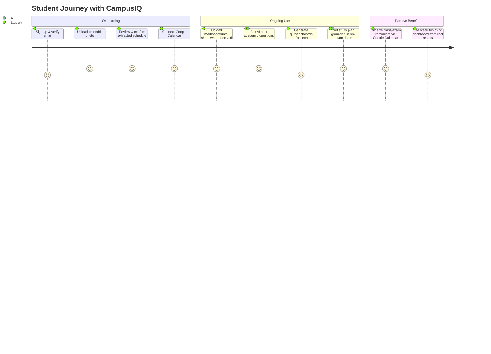
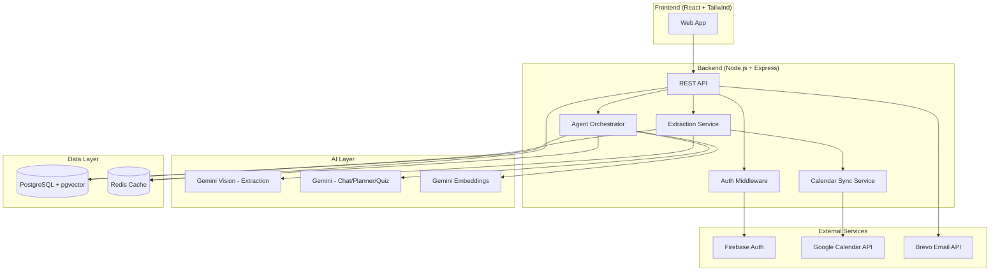
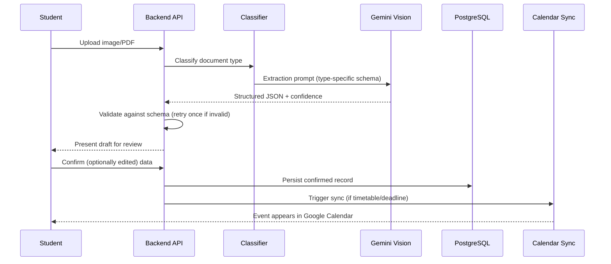
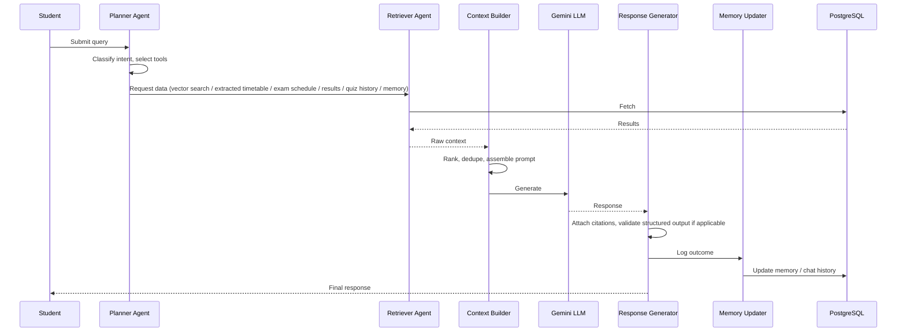
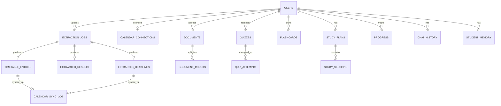
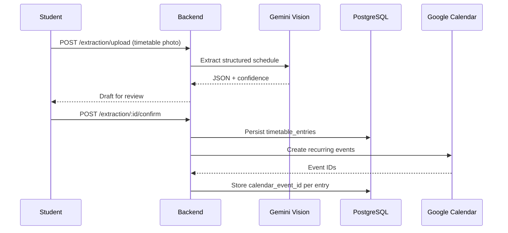
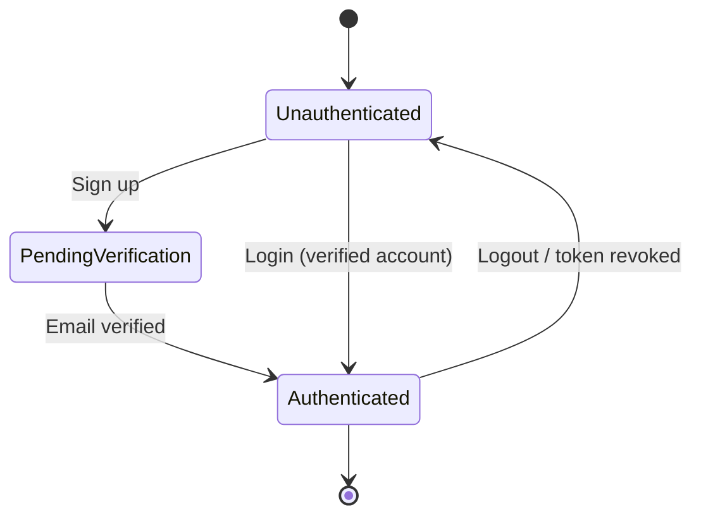
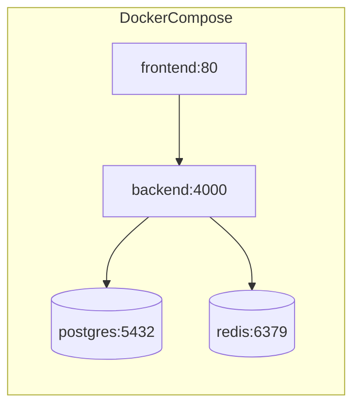

# CampusIQ — Product Requirements Document
### A Student-Focused Academic Copilot with AI Document Extraction and Google Calendar Sync

**Document Type:** Implementation-Ready PRD
**Version:** 3.0 (Final Scope)
**Status:** Draft for Engineering Review

---

## Table of Contents
1. Executive Summary
2. Vision
3. Problem Statement
4. Goals
5. Scope
6. Stakeholders
7. Personas
8. User Journey
9. Feature Specifications
10. Functional Requirements
11. Non-Functional Requirements
12. System Architecture
13. AI Architecture
14. Database Design
15. API Design
16. UI Requirements
17. Security
18. Notifications
19. Caching
20. Deployment
21. Testing Strategy
22. Risks
23. Milestones
24. Acceptance Criteria
25. Future Enhancements
26. Open Questions
27. Appendix

---

## 1. Executive Summary

CampusIQ is a student-focused academic copilot with exactly two roles: **Student** and **Admin**. There is no faculty role and no institutional workflow layer — every piece of academic data a student needs (timetable, exam schedule, results, deadlines) is captured **by the student themselves**, by photographing or uploading whatever document their college actually gives them (a printed timetable, a WhatsApp-forwarded marksheet photo, a scanned date-sheet PDF). Gemini's multimodal model extracts structured data from these documents; the student reviews and confirms it; confirmed timetables and deadlines are then synced to the student's own **Google Calendar**, which becomes the real reminder/notification surface instead of a custom in-app one. Layered on top of this grounded data is an AI study toolkit — chat/RAG over uploaded notes, a study planner, a quiz generator, flashcards, and weak-topic detection — all personalized to the student's actual extracted schedule and results. Admin exists purely to operate the platform (accounts, extraction quality monitoring, system health) and is deliberately walled off from any individual student's academic content.

---

## 2. Vision

To be the one place a student manages their academic life — no manual data entry, no institutional onboarding required, no dependency on a college adopting new software. A student uploads a photo; CampusIQ turns it into a synced calendar and a personalized study assistant.

---

## 3. Problem Statement

College students receive academic information in inconsistent, disconnected, often image-based formats: a timetable posted as a photo in a WhatsApp group, a marksheet issued as a scanned PDF, an exam date-sheet pinned to a noticeboard and photographed by someone, assignment notices forwarded as screenshots. There is no institutional system a student can rely on to structure this — and building one would require the institution itself to adopt new software, which most students cannot make happen.

Meanwhile, generic AI chatbots don't know a student's actual schedule, exam dates, or past performance, so their help is generic rather than personalized. Existing calendar/reminder apps require the student to manually transcribe every date from these messy source documents — tedious enough that most students simply don't.

CampusIQ removes the transcription step entirely: point a camera at the document, and structured data (and a synced calendar) comes out the other side.

---

## 4. Goals

| # | Goal | Success Signal |
|---|------|-----------------|
| G1 | Eliminate manual transcription of timetables/results/deadlines | ≥80% of new users complete at least one successful extraction in week 1 |
| G2 | Make Google Calendar the reliable source of academic reminders | ≥60% of active students connect Google Calendar within first session |
| G3 | Achieve extraction accuracy high enough that review is fast, not a rewrite | ≥85% of extracted fields require no correction on review (per document type) |
| G4 | Provide personalized AI study assistance grounded in real data | RAG/planner answers rated ≥4/5 relevance by sampled feedback |
| G5 | Detect weak topics using both quiz and real result data | Weak-topic flags generated from combined quiz + extracted-result signals |
| G6 | Keep the platform simple to operate | Admin can manage accounts and monitor system health without academic-content access |

---

## 5. Scope

### In Scope (v1)
- Student signup/login (Firebase Auth)
- Document/image upload with Gemini-based extraction for: timetables, marksheets/results, exam schedules, assignment/deadline notices
- Student review-and-confirm step before any extracted data is persisted
- Google Calendar OAuth connection and one-directional sync of confirmed timetables/deadlines to a dedicated CampusIQ calendar
- Standard document upload + RAG ingestion for notes/slides/syllabus (non-extraction, semantic-search path)
- Agentic AI chat grounded in uploaded materials + extracted schedule/results
- Study planner / revision planner
- AI quiz generator and flashcard generator
- Weak-topic detection and learning analytics dashboard
- Admin console: account management, aggregate extraction quality metrics, system health monitoring
- Docker-based deployment

### Out of Scope (v1)
- Any faculty, HOD, or institutional-admin role
- Institutional data feeds/LMS integrations
- Attendance tracking, results approval workflows, or any staff-entered academic data
- Native mobile apps, voice interface
- Non-Google calendar providers (Outlook, iCal) — see Open Questions
- Payments/fees, library, hostel, placements — not applicable to a student-only tool

---

## 6. Stakeholders

| Role | Interest |
|---|---|
| Students (sole end users) | Fast, accurate extraction; reliable calendar sync; genuinely personalized AI help |
| Product Manager | Adoption, extraction accuracy metrics, retention |
| AI/ML Engineers | Extraction prompt/schema quality, agent grounding correctness |
| Backend Engineers | Extraction pipeline reliability, Calendar sync idempotency, API integrity |
| Frontend Engineers | Fast, low-friction review/correction UI (this is the trust-critical screen) |
| QA Engineers | Extraction accuracy across real-world document quality (skewed photos, low light) |
| DevOps Engineers | Upload/extraction pipeline scaling, OAuth token handling reliability |
| Admin (platform operator) | Account/abuse management, system health, without needing academic-content access |

---

## 7. Personas

**Persona 1 — Aisha, Undergraduate Student**
Gets her semester timetable as a photo in a class WhatsApp group and her internal marks as a scanned PDF emailed by her department. Wants both to just "become" a calendar and a dashboard without typing anything.

**Persona 2 — Rahul, Postgraduate Student**
Denser reading load, fewer but longer documents. Relies heavily on the notes/RAG chat and quiz generator for self-testing; uses extraction mainly for exam date-sheets.

**Persona 3 — Priya, Platform Admin**
Not an academic figure — manages the CampusIQ service itself: handles a support ticket about a stuck extraction job, monitors whether timetable extraction accuracy has dropped after a prompt change, suspends an account for abuse.

---

## 8. User Journey



---

## 9. Feature Specifications

### 9.1 Document/Image Extraction (core differentiator)
**Purpose:** Convert photographed/scanned academic documents into structured, usable data.
**Flow:** Student uploads image/PDF → system classifies document type (timetable / marksheet / exam schedule / assignment notice) → Gemini Vision extracts structured JSON per a fixed schema → student reviews and edits any incorrect field → confirms → data is persisted and (for timetable/deadlines) queued for Calendar sync.
**Schemas:** See Section 13.3 (unchanged from prior draft — timetable, result, exam schedule, deadline JSON shapes).
**Edge Cases:** Low-confidence extraction flags every field for review rather than presenting it as already-correct; repeated extraction failure (2 attempts) falls back to a manual-entry form so the student is never blocked.

### 9.2 Google Calendar Sync
**Purpose:** Make Google Calendar the student's real reminder system for classes, exams, and deadlines.
**Flow:** Student connects Google account (OAuth, `calendar.events` scope only) → CampusIQ creates a dedicated "CampusIQ Academic" calendar → confirmed timetable entries become recurring weekly events; confirmed exam dates/deadlines become single events → edits/deletes to source records propagate to the corresponding Calendar event via a stored event-ID mapping.
**Edge Cases:** Disconnecting Calendar stops future sync but does not retroactively delete existing events (avoid surprising data loss); token refresh failures are retried and surfaced to the student if persistent.

### 9.3 Academic Document Upload (RAG path)
**Purpose:** Separate from structured extraction — notes/slides/syllabus are chunked and embedded for semantic search and chat grounding, not turned into structured records.
**Flow:** Upload → text extraction → chunking (~500–800 tokens, overlap) → Gemini Embeddings → pgvector storage.

### 9.4 AI Academic Chat / Agentic RAG
**Purpose:** Multi-turn conversational assistant grounded in uploaded materials plus the student's extracted schedule/results.
**Tools available to the agent:** vector search (notes/slides), extracted timetable, extracted exam schedule/deadlines, extracted results, quiz history, student memory.
**Edge Cases:** No relevant material found → explicit "not found in your materials" fallback rather than fabrication.

### 9.5 Study Planner / Revision Planner
**Purpose:** Generate study plans using extracted exam dates and extracted timetable (to avoid scheduling over real classes), plus weak topics.

### 9.6 AI Quiz Generator
**Purpose:** Generate quizzes from uploaded notes/slides at Easy/Medium/Hard difficulty, scored with post-submission explanations.

### 9.7 Flashcard Generator
**Purpose:** Auto-generate spaced-repetition flashcards from a topic or document.

### 9.8 Weak Topic Detection
**Purpose:** Flag weak topics from a combination of quiz accuracy **and** extracted marksheet results — a low extracted score on a subject is itself a weak-topic signal even before any quiz is taken on it.

### 9.9 Learning Dashboard / Analytics
**Purpose:** Single-glance view of study hours, streaks, weak topics, upcoming deadlines (pulled from extracted data + Calendar-synced items), and subject-wise performance combining quiz and extracted-result data.

### 9.10 Student Memory
**Purpose:** Long-term personalization store (preferences, recurring weak areas, plan adherence) used to tailor future agent responses.

---

## 10. Functional Requirements

**Authentication**
- FR-001: System shall allow student signup via Firebase Authentication (email/password).
- FR-002: System shall require email verification before full access.
- FR-003: System shall support only two roles: student and admin.

**Extraction**
- FR-004: System shall accept image (JPG/PNG) and PDF uploads for structured extraction.
- FR-005: System shall automatically classify uploaded document type, with manual override available.
- FR-006: System shall extract structured data via Gemini according to a fixed schema per document type (timetable, result, exam schedule, deadline).
- FR-007: System shall validate extraction output against its JSON schema and retry once automatically on failure.
- FR-008: System shall present all extracted fields to the student for review before persisting.
- FR-009: System shall not persist or sync any extracted data without explicit student confirmation.
- FR-010: System shall fall back to manual entry if extraction fails twice.
- FR-011: System shall flag every field for review when extraction confidence is low.

**Google Calendar**
- FR-012: System shall allow students to connect/disconnect a Google Calendar account via OAuth, scoped to `calendar.events` only.
- FR-013: System shall create and sync to a dedicated CampusIQ calendar, not the student's primary calendar.
- FR-014: System shall sync confirmed timetable entries as recurring weekly events.
- FR-015: System shall sync confirmed exam dates and deadlines as single events.
- FR-016: System shall update or delete the corresponding Calendar event when a source record is edited or deleted.
- FR-017: System shall continue functioning without Calendar sync if a student has not connected an account.

**RAG & Documents**
- FR-018: System shall accept PDF/PPTX/DOCX/TXT uploads for RAG ingestion, separate from structured extraction.
- FR-019: System shall chunk, embed, and index documents in pgvector.
- FR-020: System shall support semantic search returning top-k chunks with source attribution.

**Agentic Chat**
- FR-021: System shall classify each chat query's required tools before retrieval.
- FR-022: System shall support multi-turn conversation with persisted history.
- FR-023: System shall cite sources in RAG-grounded answers.
- FR-024: System shall fall back gracefully when no relevant context is found.

**Study Tools**
- FR-025: System shall generate a study plan grounded in extracted exam dates and timetable.
- FR-026: System shall generate quizzes from uploaded notes/slides at selectable difficulty.
- FR-027: System shall score quiz attempts and provide explanations.
- FR-028: System shall generate spaced-repetition flashcards from a topic or document.

**Analytics**
- FR-029: System shall flag weak topics using both quiz accuracy and extracted result data.
- FR-030: System shall display subject-wise performance combining both signals.

**Admin**
- FR-031: System shall allow Admin to search, suspend, and reinstate student accounts.
- FR-032: System shall provide Admin with aggregate, anonymized extraction quality metrics.
- FR-033: System shall prevent Admin routes from returning any individual student's academic content.
- FR-034: System shall provide Admin visibility into system health (queue depth, extraction failure rate, Calendar sync failure rate).

---

## 11. Non-Functional Requirements

| Category | Requirement |
|---|---|
| Performance | Extraction job completes in < 15s for a single-page document; AI chat first-token latency < 2.5s |
| Availability | 99.5% uptime for upload/extraction and core API endpoints |
| Reliability | Failed extraction retries once automatically; Calendar sync is idempotent, keyed by stored event ID |
| Scalability | Stateless backend instances behind a load balancer; extraction jobs processed via a queue to absorb upload spikes |
| Security | OAuth tokens encrypted at rest; JWT verification on every protected route; Admin cannot access individual academic content |
| Accessibility | WCAG 2.1 AA target for core pages, especially the extraction review screen |
| Usability | Review/correction requires only editing pre-filled fields, never blank re-entry |
| Maintainability | Extraction prompts/schemas versioned so accuracy regressions are traceable |

---

## 12. System Architecture



---

## 13. AI Architecture

### 13.1 Two Distinct AI Pipelines

CampusIQ uses Gemini for two structurally different jobs, kept architecturally separate:

1. **Extraction pipeline** (deterministic-shaped output): image/PDF → Gemini Vision → strict JSON schema → validation → human confirmation. No conversational reasoning, no tool-calling — a single-purpose structured-output call per document type.
2. **Agentic pipeline** (conversational/reasoning): chat, study planning, quiz/flashcard generation — a Planner → Retriever → Context Builder → LLM → Response Generator → Memory Updater flow, unchanged in shape from the original CampusIQ design.

### 13.2 Extraction Pipeline Detail



### 13.3 Extraction Schemas

**Timetable:**
```json
{ "entries": [ { "day_of_week": "Monday", "start_time": "09:00", "end_time": "10:00", "subject_name": "Data Structures", "location": "Room 204" } ], "confidence": "high" }
```

**Result/marksheet:**
```json
{ "exam_label": "Semester 3 Internal 1", "subjects": [ { "subject_name": "Operating Systems", "marks_obtained": 42, "max_marks": 50 } ], "confidence": "high" }
```

**Exam schedule:**
```json
{ "exams": [ { "subject_name": "Database Systems", "exam_date": "2026-11-14", "start_time": "10:00" } ], "confidence": "high" }
```

**Deadline/assignment notice:**
```json
{ "deadlines": [ { "title": "DBMS Assignment 2", "due_date": "2026-09-20", "subject_name": "Database Systems" } ], "confidence": "high" }
```

### 13.4 Agentic Pipeline Detail



### 13.5 Tool Inventory (Agentic Pipeline)

| Tool | Used For |
|---|---|
| Vector Search (pgvector) | Semantic retrieval from uploaded notes/slides |
| Extracted Timetable | Avoiding schedule conflicts in study plans, "what's my next class" |
| Extracted Exam Schedule / Deadlines | Countdown, revision urgency, deadline-aware answers |
| Extracted Results | Weak-topic signal, progress questions |
| Quiz History | Weak-topic detection, progress questions |
| Student Memory | Personalization, recurring preferences |

---

## 14. Database Design

### 14.1 Entity-Relationship Diagram



### 14.2 Table Specifications

**users**
- `id (uuid, PK)`, `firebase_uid (unique)`, `email (unique)`, `full_name`, `role (enum: student, admin)`, `status (enum: active, suspended)`, `created_at`, `updated_at`
- Indexes: unique on `firebase_uid`, `email`; index on `role`

**extraction_jobs**
- `id (PK)`, `user_id (FK)`, `source_file_path`, `document_type (enum: timetable, result, exam_schedule, deadline, notes)`, `status (enum: pending, processing, needs_review, confirmed, failed)`, `raw_extraction (jsonb)`, `confidence (enum: high, medium, low)`, `created_at`, `confirmed_at`
- Indexes: index on `(user_id, status)`

**timetable_entries**
- `id (PK)`, `user_id (FK)`, `extraction_job_id (FK)`, `day_of_week`, `start_time`, `end_time`, `subject_name`, `location (nullable)`, `semester_start_date`, `semester_end_date`, `calendar_event_id (nullable)`
- Indexes: index on `(user_id, day_of_week)`

**extracted_results**
- `id (PK)`, `user_id (FK)`, `extraction_job_id (FK)`, `exam_label`, `subject_name`, `marks_obtained`, `max_marks`, `created_at`
- Indexes: index on `(user_id, subject_name)`

**extracted_deadlines**
- `id (PK)`, `user_id (FK)`, `extraction_job_id (FK)`, `type (enum: exam, assignment)`, `title`, `subject_name (nullable)`, `due_date (timestamptz)`, `calendar_event_id (nullable)`
- Indexes: index on `(user_id, due_date)`

**calendar_connections**
- `id (PK)`, `user_id (FK, unique)`, `access_token (encrypted)`, `refresh_token (encrypted)`, `calendar_id`, `connected_at`, `status (enum: active, revoked)`

**calendar_sync_log**
- `id (PK)`, `user_id (FK)`, `source_table (enum: timetable_entries, extracted_deadlines)`, `source_id`, `action (enum: created, updated, deleted)`, `calendar_event_id`, `synced_at`, `status (enum: success, failed)`

**documents**
- `id (PK)`, `user_id (FK)`, `title`, `file_type (enum: pdf, pptx, docx, txt)`, `storage_path`, `status (enum: processing, ready, failed)`, `uploaded_at`

**document_chunks**
- `id (PK)`, `document_id (FK)`, `chunk_index`, `content`, `embedding (vector(768))`, `page_reference (nullable)`
- Indexes: vector index on `embedding`; index on `document_id`

**quizzes** / **quiz_attempts** / **flashcards** / **study_plans** / **study_sessions** / **progress** / **chat_history** / **student_memory** / **sessions**
- Unchanged in shape from the original CampusIQ design (subject/topic fields now reference `subject_name` strings extracted from documents rather than an institutional subject table, since there is no faculty/curriculum system in this version).

---

## 15. API Design

Base URL: `/api/v1`. All routes require `Authorization: Bearer <firebase_jwt>`; role checks enforced server-side.

### 15.1 Auth
- `POST /auth/register` — create profile after Firebase signup
- `POST /auth/session` — exchange verified token for backend session

### 15.2 Extraction
- `POST /extraction/upload` — upload image/PDF with declared or auto-detected type → 202 `{ extraction_job_id, status }`
- `GET /extraction/:jobId` — poll status / fetch draft for review
- `POST /extraction/:jobId/confirm` — persist (optionally corrected) data → triggers Calendar sync if applicable
- `POST /extraction/:jobId/reject` — discard

### 15.3 Google Calendar
- `GET /calendar/connect` — start OAuth
- `GET /calendar/callback` — token exchange
- `DELETE /calendar/disconnect`
- `POST /calendar/resync`

### 15.4 Timetable / Results / Deadlines
- `GET/PATCH/DELETE /timetable/:id`
- `GET/PATCH/DELETE /results/:id`
- `GET/PATCH/DELETE /deadlines/:id`
(edits/deletes on synced records re-trigger Calendar Sync Service)

### 15.5 RAG & Search
- `POST /documents/upload`
- `GET /documents/:id/status`
- `POST /search/semantic`

### 15.6 Agentic Chat
- `POST /chat/message`
- `GET /chat/history?conversation_id=`

### 15.7 Study Tools
- `POST /plans/generate`
- `PATCH /plans/:id/sessions/:sessionId`
- `POST /quizzes/generate`
- `POST /quizzes/:id/submit`
- `POST /flashcards/generate`
- `POST /flashcards/:id/review`

### 15.8 Analytics
- `GET /analytics/dashboard`

### 15.9 Admin
- `GET /admin/users`
- `PATCH /admin/users/:id/status`
- `GET /admin/extraction-metrics`
- `GET /admin/system-health`

### 15.10 Example Sequence — Extraction to Calendar



---

## 16. UI Requirements

### 16.1 Global
- Responsive layout (React + Tailwind), persistent nav: Dashboard, Chat, Documents, Extract, Planner, Quizzes, Flashcards, Settings.
- Global loading skeletons, toast system for errors/success.

### 16.2 Key Pages

**Extraction Upload & Review** *(the most important screen in the product)*
- Components: drag-and-drop/camera upload, document-type selector (with auto-detected default), extraction progress indicator, side-by-side view of original image and editable extracted fields, per-field confidence highlighting, confirm/discard buttons.
- States: Processing (spinner + "reading your document"), Needs Review (editable form), Failed (manual-entry fallback form), Confirmed (success + "synced to Calendar" indicator if applicable).

**Dashboard**
- Progress ring, weekly study-hours chart, weak-topics chip list (from quiz + extracted results), upcoming-deadlines card (pulled from extracted data), Calendar-connection status banner if not yet connected.

**Chat**
- Message list with citation chips, input box, suggested actions (e.g., "Generate a quiz on this," "Add this to my study plan").

**Documents**
- Upload dropzone, table of documents with status badges, distinct from the Extraction flow (this is the RAG-ingestion path for notes/slides).

**Settings**
- Profile, Google Calendar connect/disconnect control with connection status, notification preferences, account deletion.

**Admin Console** *(separate, minimal UI)*
- Account search/table with suspend/reinstate actions, extraction-metrics charts (accuracy by document type over time), system-health panel (queue depth, error rates). No access to any individual student's uploaded content.

---

## 17. Security

- Firebase JWT verification on every protected route.
- Row-level ownership: every query filters by `user_id` from the verified token, never a client-supplied ID.
- **Google OAuth tokens** encrypted at rest, scoped to `calendar.events` only.
- **Extraction confirmation gate:** no extracted data is persisted or synced without explicit student confirmation — the primary safeguard against acting on a misread date or score.
- Input validation on every request body; parameterized queries throughout.
- Prompt-injection mitigation: retrieved document content is delimited as untrusted context, never treated as instructions.
- Rate limiting on `/auth/*`, `/extraction/*`, and `/chat/*`.
- CORS restricted to known frontend origins.
- **Admin data boundary:** admin-role tokens are rejected by all student-content endpoints (documents, chat, extraction data) at the middleware level, not merely hidden in the UI.

### 17.1 Authentication State Diagram



---

## 18. Notifications

With Google Calendar as the primary deadline/reminder surface, in-app email (Brevo) is scoped down to secondary, non-time-critical nudges:

| Email Type | Trigger |
|---|---|
| Email Verification (OTP) | Signup |
| Extraction Failed / Needs Attention | Extraction job fails twice |
| Weak Topic Detected | New weak-topic flag generated |
| Calendar Sync Issue | Repeated token refresh failure |

Deadline/exam reminders are intentionally **not** duplicated via email — Calendar owns that responsibility.

---

## 19. Caching

| Cache Type | Key Pattern | TTL | Invalidation |
|---|---|---|---|
| Session Cache | `session:{user_id}` | 24h | Logout/revoke |
| AI Response Cache | `ai:chat:{hash(query+context)}` | 15 min | New document upload or new extraction confirmed |
| Retrieval Cache | `retrieval:{user_id}:{query_hash}` | 10 min | Document change |
| Dashboard Aggregate Cache | `dashboard:{user_id}` | 5 min | Quiz submission, extraction confirmed, plan update |

---

## 20. Deployment

**Docker Containers:** `frontend` (React/Nginx), `backend` (Node/Express — includes Extraction Service, Agent Orchestrator, Calendar Sync Service), `postgres` (with pgvector), `redis`. Firebase, Gemini, Google Calendar, and Brevo are external managed services.

**Environment Variables:** `DATABASE_URL`, `REDIS_URL`, `GEMINI_API_KEY`, `FIREBASE_SERVICE_ACCOUNT_JSON`, `GOOGLE_OAUTH_CLIENT_ID/SECRET`, `BREVO_API_KEY`, `NODE_ENV`.



---

## 21. Testing Strategy

| Type | Focus |
|---|---|
| Unit | Schema validation, document-type classification, confidence-flagging logic |
| Integration | Full extraction → review → confirm → calendar-sync pipeline |
| AI/Extraction Testing | Golden-set of real-world-quality timetable/marksheet/date-sheet images (clean, phone photo, skewed, low light) — measure field-level accuracy |
| Calendar Sync Testing | Create/update/delete idempotency; token refresh; reconnect-after-disconnect |
| Security Testing | Admin-role token rejected on every student-content endpoint |
| Load Testing | Concurrent extraction uploads at semester-start spikes |
| Acceptance Testing | End-to-end scenarios against Section 24 |

---

## 22. Risks

| Risk | Mitigation |
|---|---|
| Extraction misreads a critical date (exam/deadline) | Mandatory human review-and-confirm before persist or sync |
| Poor accuracy on handwritten or low-quality photos | Confidence flagging forces full-field review; manual-entry fallback after repeated failure |
| Google OAuth token expiry/revocation breaks sync silently | Sync failure logging + student-facing notification |
| Admin boundary accidentally leaks student content via a shared query path | Explicit role-based middleware rejection, tested per endpoint |
| LLM hallucination in chat answers | Grounding instructions, citation requirement, explicit "not found" fallback |

---

## 23. Milestones

| Phase | Deliverable |
|---|---|
| Phase 1 | Auth (student/admin only), app shell |
| Phase 2 | Extraction pipeline — timetable first (upload → classify → extract → review → confirm) |
| Phase 3 | Google Calendar OAuth + sync (timetable, then deadlines/exams) |
| Phase 4 | Extend extraction to results/marksheets; wire into weak-topic detection |
| Phase 5 | RAG ingestion + agentic chat, grounded in extracted data |
| Phase 6 | Study planner, quiz generator, flashcards |
| Phase 7 | Admin console, hardening, load testing, launch |

---

## 24. Acceptance Criteria

| Feature | Acceptance Criteria |
|---|---|
| Extraction | A clean-quality timetable image produces a reviewable draft within 15s with ≥85% of fields correct pre-edit |
| Confirmation Gate | No record appears in `timetable_entries`/`extracted_deadlines`/`extracted_results` without a corresponding `confirmed` extraction_job |
| Calendar Sync | Confirming a timetable creates the correct number of recurring events in the dedicated CampusIQ calendar within 30s |
| Sync Idempotency | Editing a confirmed deadline updates (not duplicates) the existing Calendar event |
| Weak Topic Detection | A subject with an extracted result below threshold is flagged weak even with zero quiz attempts |
| Admin Boundary | Any admin-token request to a student-content endpoint returns 403 |

---

## 25. Future Enhancements

- Outlook/iCal calendar provider support
- Mobile application with native camera capture
- Handwritten-note extraction support
- Faculty/institution-side integration (opt-in, if ever pursued) — deliberately deferred, not designed against in this version
- Multi-language document extraction
- Shared/study-group features

---

## 26. Open Questions

1. Retention policy for raw uploaded images/PDFs after extraction is confirmed.
2. Whether handwritten timetables/notices are in scope for v1 extraction accuracy targets, or explicitly unsupported.
3. Whether Admin should ever have a time-boxed, logged, student-consented support-access exception, or the content boundary is absolute.
4. Handling of multiple timetables per student (e.g., separate lab schedule) — one merged Calendar sync or separate sources.
5. Behavior at semester end — auto-archive recurring timetable Calendar events, or leave until manually cleared.
6. Whether a non-Calendar fallback (e.g., in-app reminders) is needed for students who decline Google OAuth.

---

## 27. Appendix

### 27.1 Glossary
- **RAG:** Retrieval-Augmented Generation — grounding LLM output in retrieved documents.
- **Extraction pipeline:** The deterministic-schema Gemini Vision flow that turns an image/PDF into structured JSON, distinct from the conversational agentic pipeline.
- **pgvector:** PostgreSQL extension for vector similarity search.

### 27.2 Sample Project Structure

```
campusiq/
├── frontend/
│   └── src/{pages,components,hooks,routes,services,styles}
├── backend/
│   └── src/
│       ├── api/                # Express routers
│       ├── services/
│       │   ├── extraction/     # classifier, Gemini Vision calls, schema validation
│       │   ├── calendar/       # OAuth, sync service
│       │   ├── agent/          # Planner, Retriever, ContextBuilder, MemoryUpdater
│       │   └── rag/            # chunking, embedding, retrieval
│       ├── middleware/         # auth, validation, rate-limit, role scope
│       └── db/                 # migrations, models, queries
├── docker/
│   ├── docker-compose.yml
│   ├── backend.Dockerfile
│   └── frontend.Dockerfile
└── docs/
```

### 27.3 Representative User Stories

1. As a student, I want to photograph my timetable, so that I don't have to type it in manually.
2. As a student, I want to review extracted data before it's saved, so that I can fix any misread fields.
3. As a student, I want my confirmed timetable synced to Google Calendar, so that I get reminders where I already look.
4. As a student, I want a dedicated calendar for CampusIQ events, so that my personal calendar isn't cluttered.
5. As a student, I want to upload a marksheet photo, so that my results feed into weak-topic detection automatically.
6. As a student, I want to upload an exam date-sheet, so that countdowns and revision plans use the real dates.
7. As a student, I want to ask the AI questions grounded in my notes, so that answers are relevant to my actual course.
8. As a student, I want a study plan that avoids my real class times, so that it's realistic.
9. As a student, I want quizzes generated from my own notes, so that I can self-test effectively.
10. As a student, I want flashcards with spaced repetition, so that I revise efficiently.
11. As a student, I want to disconnect Google Calendar without losing past events, so that I stay in control of my data.
12. As an admin, I want to see aggregate extraction accuracy, so that I know when a prompt needs improvement.
13. As an admin, I want to suspend an abusive account, so that the platform stays safe, without ever seeing that student's uploaded content.

---

*End of Document.*
